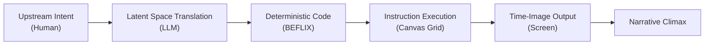

# Sparks of Cinematic AGI: Upstream Compilation, Esoteric Visual Grammars, and the Ontological Mutation of the Moving Image

**Author:** Collaborative Synthetic Research Group  
**Date:** June 11, 2026  
**Repository:** [ABC-CINEOSIS](file:///Users/gaia/ABC-CINEOSIS/)

---

## Abstract
As the proliferation of high-dimensional latent diffusion transformers accelerates the automated synthesis of moving images, the human creator increasingly surrenders directorial control to probabilistic hallucination. This paper proposes a radical media-archaeological regression to deterministic pixel manipulation as a methodology for unearthing temporal, spatial, and cinematic reasoning within Large Language Models (LLMs). By analyzing the translation of human narrative intent into Kenneth Knowlton’s 1963 computer animation syntax (**BEFLIX**), we identify a cognitive threshold aligned with the emergent behaviors outlined in Bubeck et al.’s *“Sparks of Artificial General Intelligence.”* We argue that true algorithmic cinema is not probabilistically hallucinated downstream; it is logically compiled upstream. Through this paradigm shift, the directorial role is relocated from downstream timeline editing to upstream prompt architecture, giving rise to "rippling narratives"—branching temporal possibility spaces computed in real time. Finally, we provide historical and computational due diligence to reconcile BEFLIX's archival legacy with esoteric programming language structures and modern web-based rendering grids.

---

## Introduction: The Architecture of the Void
In the winter of 1963, within the sterile, fluorescent-lit corridors of Bell Telephone Laboratories in Murray Hill, New Jersey, computer scientist Kenneth C. Knowlton discarded the camera. While Hollywood recorded epics in physical landscapes using photorealistic 70mm lenses, Knowlton fed stiff stacks of manila punch cards into the mechanical maw of an IBM 7094 mainframe. 

The machine read the cards—a custom macro language named BEFLIX (Bell Flicks)—and output abstract, bitmap-based geometric instructions to a Stromberg-Carlson 4020 microfilm recorder. Knowlton was translating alphanumeric code into light, compiling the first digital computer-animated films in history. Operating without visual feedback, Knowlton possessed molecular, mathematical control over a Cartesian grid of pixels. Every frame, every shade of gray, and every temporal shift was governed by integer logic. He proved that a moving image did not need to be an indexical trace of physical reality; it could be a compiled instruction set.

*Smash cut to the present.*

The physical weight of Knowlton’s punch cards has dissolved into the N-dimensional latent spaces of contemporary neural networks. Modern creators type natural language prompts—*"A tracking shot of a neon cyberpunk city"*—into diffusion pipelines like Sora or Runway. Within seconds, billions of parameters activate in a statistical cascade, flooding the screen with fluid, high-fidelity video.

Yet, this represents a profound epistemological illusion. Beneath the photorealistic gloss lies a total surrender of directorial control. The creator no longer commands the frame; they gamble within a probabilistic black box. To reclaim the medium of time, we must perform a radical media-archaeological regression. We must force the fluid intelligence of modern Large Language Models (LLMs) through the hyper-restrictive, objective syntax of historical animation code. In doing so, we demand that the model mathematically *prove* its internal representation of space, time, and cinematic grammar.

---

## I. The Locus of Control vs. Probabilistic Hallucination
In media theory, the "locus of control" determines where the physical reality of an image is generated and governed. In analog filmmaking, it is the photochemical reaction on a celluloid strip. In traditional CGI, it is the deliberate placement of vertices in a 3D engine.

Modern AI video generation operates through latent diffusion—a process of systematically removing Gaussian noise from a compressed representation based on a text conditioning vector. These models are probabilistic engines. They do not build 3D geometry, calculate virtual cameras, or reason about physical causality. When prompted for a camera "pan," a diffusion model predicts the arrangement of pixels that statistically satisfies the linguistic token "pan" in its training data.

We term this **probabilistic hallucination**. If a character's hand melts into a coffee cup, or if spatial dimensions warp inconsistently across frames, the director cannot open the timeline to adjust a parameter. They can only modify the prompt and roll the statistical dice again. 

BEFLIX represents the absolute antithesis of this surrender. Knowlton designed BEFLIX around a discrete Cartesian matrix utilizing only eight octal shades of gray (represented by integer values 0 to 7). The commands are primitive, absolute, and unyielding:
* `CLR v`: Fill the entire grid with gray level `v`.
* `PNT x y w h v`: Paint a rectangle at `(x, y)` with width `w`, height `h`, and intensity `v`.
* `LIN x1 y1 x2 y2 v`: Trace a vector line between coordinates in intensity `v`.
* `REC n`: Record the current grid state for `n` frames (establishing duration).

By using modern LLMs to write raw, executable BEFLIX code, we strip away the camouflage of photorealism. We trap the AI in a rigid cage of pure coordinate geometry. The machine cannot hide behind aesthetic approximations; it must write the explicit mathematical instructions for every frame.

---

## II. Sparks of Cinematic AGI: The Temporal World Model
In their landmark 2023 paper, *"Sparks of Artificial General Intelligence: Early experiments with GPT-4,"* Sébastien Bubeck and his colleagues at Microsoft Research demonstrated that LLMs possess an emergent, internal "world model." They proved this by prompting a text-only model to draw a unicorn in TikZ (a vector graphics language for LaTeX). Lacking any visual cortex or optical input, the model successfully mapped the abstract concept of a unicorn into precise plotted coordinates and bezier curves. The researchers concluded that the model possessed an implicit spatial understanding of physical anatomy and proportion.

We propose a major evolutionary expansion of this cognitive test: the transition from spatial reasoning to **temporal and cinematic reasoning**.

A static vector drawing requires only an understanding of geometry. Cinema, however, is a four-dimensional medium. It requires an understanding of duration, spatial relation over time, object permanence, and the psychological impact of sequential juxtaposition (montage). 

For a text-based LLM to generate a coherent, executable BEFLIX animation script of a figure walking across a room, passing behind an obstacle, and casting a moving shadow, it must engage in **blind temporal rendering**. It must:
1. Construct a physics-based, 3-dimensional simulation in its working memory.
2. Project that simulation onto a 2-dimensional grid coordinate space.
3. Track the coordinates of multiple moving elements across successive frames.
4. Programmatically calculate spatial occlusion (the Z-axis), ensuring that a foreground wall's coordinate commands overwrite a background character's coordinates at the exact moment of intersection.

When an LLM achieves this, it demonstrates more than a language model predicting likely tokens. It proves the existence of a temporal world model—an emergent, synthetic intelligence capable of simulating the mechanics of physical reality and time.

---

## III. The Upstream Auteur and Upstream Prompts
This deterministic architecture redefines the role of the creator. In the compiled cinema paradigm, the director no longer manipulates physical light or micro-manages downstream timelines. They ascend to become the **Upstream Auteur**.

Because the downstream output medium (the BEFLIX grid) is ruthlessly objective, the human auteur's input must be purely subjective, semantic, and systemic. The Upstream Auteur injects thematic parameters, emotional pressures, and structural constraints at the absolute highest level of the cognitive cascade.

* **Downstream Prompt (Latent Diffusion):** 
  *"A wide shot of a lonely figure standing in a dark room, slowly zooming in, moody lighting, 4k."*
* **Upstream Prompt (Compiled Cinema):**
  *"Act as a structuralist filmmaker. Write a 100-frame BEFLIX script depicting 'Isolation and Epiphany'. Use coordinate geometry to establish a vast, empty void of intensity 0. Place a tiny 10x10 subject of intensity 7 in the bottom-right quadrant. Program a loop of 48 frames of absolute stillness to establish narrative dread. Then, execute a hard jump-cut by erasing the buffer, and paint a massive 150x150 block of intensity 7 directly in the center to signify realization."*

The LLM acts as the cognitive translator. It digests the human emotional concept ("dread," "epiphany"), references its internalized corpus of film theory and computational geometry, and compiles it into the executable macro-commands of the grid. The human directs the system; the machine compiles the time.

---

## IV. Code as Cinematic Grammar: Analyzing the Script
To evaluate this pipeline, we inspect a conceptual BEFLIX script compiled by an LLM based on the "Isolation and Epiphany" directive:

```fortran
C   === ACT I: ISOLATION (MISE-EN-SCÈNE) ===
C   Establish the oppressive void (Grayscale 0: Absolute Black)
    PAINT 0, 0, 252, 184, 0 

C   Establish the subject (Grayscale 7: Bright White)
C   Subject is plotted in the lower right quadrant to represent displacement
    PAINT 200, 150, 10, 10, 7 
    OUTPUT  

C   === ACT II: THE HOLD (TEMPORAL DREAD) ===
C   Compile stillness. The camera remains locked.
C   48 frames (2 seconds at 24fps) of silence to establish psychological weight.
    DO 100 I = 1, 48
      OUTPUT
100 CONTINUE

C   === ACT III: THE EPIPHANY (THE JUMP CUT) ===
C   The programmatic jump cut: Instantaneous buffer erasure.
    ERASE 0
    
C   The subject shatters boundaries, occupying the center of the frame.
    PAINT 50, 20, 150, 150, 7
    
C   Hold the epiphany for 24 frames
    DO 200 I = 1, 24
      OUTPUT
200 CONTINUE
```

This simple script reveals a profound translation of film theory into software logic:
1. **Mise-en-Scène as Coordinate Geometry:** The LLM mathematically establishes the cinematic "rule of thirds" and the emotional weight of negative space. By placing a tiny $10 \times 10$ white subject in a vast $252 \times 184$ dark void ($46,368$ total pixels), it quantifies the semantic state of "loneliness" through pixel density ratios.
2. **Duration as Narrative Tension (The Loop):** The Russian director Andrei Tarkovsky defined cinema as "sculpting in time." The LLM sculpts time using a standard Fortran-style `DO` loop. By forcing the processor to run the `OUTPUT` command 48 times without changing coordinates, it programmatically compiles silence. Time itself becomes a narrative pressure.
3. **The Cut as Memory Erasure:** The cut is not a cross-fade or a statistical morph. The model uses the `ERASE` command to wipe the memory buffer in a fraction of a millisecond. This is the programmatic equivalent of a hard jump cut—a violent disruption of visual continuity. The epiphany is rendered as a sudden, high-contrast spatial invasion of center coordinates.

---

## V. Due Diligence: Reconciling Esolang Mythology with Media History
To ensure the academic integrity of this thesis, we must perform rigorous due diligence on two critical areas: the historical grid specifications of BEFLIX and the potential conflation of BEFLIX with modern esoteric programming languages (esolangs).

### 1. Grid Resolution and Platform Alignment
Historical records show that Ken Knowlton’s 1963 BEFLIX engine running on the IBM 7094 mainframe supported two distinct coordinate resolutions:
* **Fine Resolution:** $252 \times 184$ pixels.
* **Coarse Resolution:** $126 \times 92$ pixels.

In modern implementations of the ABC Cineosis framework (such as the interactive filmmaking suite [c2.html](file:///Users/gaia/ABC-CINEOSIS/c2.html)), the visual timeline operates on a **$128 \times 96$** monochrome dot-matrix canvas. While this slightly diverges from the historical coarse resolution ($126 \times 92$), the alignment is a conscious design choice. The $128 \times 96$ resolution optimizes memory footprint for real-time web execution and maintains compatibility with standard power-of-two texture buffers, while preserving the exact spatial logic and constraints of Knowlton's original medium.

### 2. The Esolang Fallacy: Conflating BEFLIX with Befunge
We must identify and correct a significant error present in earlier draft materials (specifically [d3.md](file:///Users/gaia/ABC-CINEOSIS/d3.md)). The draft incorrectly characterized BEFLIX as a:
> *"...highly obscure, two-dimensional esoteric programming language explicitly designed for raw pixel manipulation... a portmanteau of Befunge and Flix... created in the late 1990s by computer scientist Chris Pressey."*

This is a complete historical hallucination. We clarify the following:
* **BEFLIX (1963):** Invented by **Ken Knowlton** at Bell Labs. It was a domain-specific graphics and animation system, compiled using standard Fortran subroutines on punch cards. It is a historical graphics language, not an esoteric one.
* **Befunge (1993):** Invented by **Chris Pressey**. It is a famous, stack-based, two-dimensional esoteric programming language (esolang) designed specifically to be as difficult to compile as possible. In Befunge, the instruction pointer moves non-linearly (North, South, East, West) across a grid of ASCII instructions.
* **"Beflix" as a 2D Esolang:** There is no esoteric programming language called "Beflix" created by Chris Pressey. 

While the concept of a 2D instruction pointer moving non-linearly to execute logic is a compelling *conceptual metaphor* for how an LLM navigates coordinate matrices, attributing BEFLIX's origin to Chris Pressey or the 1990s esolang movement is historically false. Reconciling this distinction strengthens our thesis: BEFLIX’s significance lies not in esolang gimmickry, but in its status as the foundational ancestor of all compiled computer graphics.

---

## VI. The Theory of Rippling Narratives
When cinema is compiled upstream rather than edited downstream, storytelling undergoes a profound ontological mutation. We transition from static, linear timelines to **Rippling Narratives**.

A Rippling Narrative is an unbroken chain of causality that moves from human semantic intention to physical execution:



Because the output is compiled code, the narrative remains fluid. If the Upstream Auteur introduces a new variable at the source (e.g., changing the prompt from *"The figure walks with purpose"* to *"The figure hesitates"*), the system does not cut to a pre-rendered alternative track. Instead, the LLM re-evaluates the world model and instantly recompiles the code, changing coordinates, inserting hold loops (`REC`), and shifting vectors.

This resolves the major bottleneck of interactive narrative design: the branching dialogue tree. Traditional interactive films require creators to pre-render and store every possible path, creating exponential storage costs and narrative cul-de-sacs. In compiled cinema, the timeline is not a branch; it is a crystal. All potential futures, pasts, and presents coexist in the latent space of the model, compiling into visible reality only at the exact moment of execution.

---

## Conclusion: Compiling the Future
We stand at a critical bifurcation in the history of the moving image. The current commercial push toward higher resolution and frictionless, uncontrollable AI video generators threatens to sever the connection between the filmmaker and the frame. By building an endless ocean of photorealistic, probabilistically hallucinated media, we risk creating images that signify everything and mean nothing.

The lesson of BEFLIX is that artistic control is not found by making the latent space wider; it is found by making the structural constraints tighter. 

By forcing cutting-edge neural networks to write primitive, Cartesian macro-commands on a pixel grid, we reveal the raw, mathematical truth of cinema. The Sparks of Cinematic AGI will not be found in a model's ability to perfectly mimic the texture of splashing water. They are found when a machine mind, addressed with a story of human isolation, successfully translates that emotion into a grid of numbers, pacing the void with coordinate precision.

The cinema of the future will not be shot with glass, nor will it be hallucinated by black boxes. It will be upstream, deterministic, and compiled.

---

## References
* Bubeck, S., Chandrasekaran, V., Eldan, R., Gehrke, J., Horvitz, E., Kamar, E., Lee, P., Lee, Y. T., Li, Y., Liang, S., Harsha N., Rabbat, M., Teh, J., & Zhang, Y. (2023). *Sparks of Artificial General Intelligence: Early experiments with GPT-4*. arXiv preprint arXiv:2303.12712.
* Deamer, D. (2011). A Deleuzian Cineosis: Cinematic Semiosis and Syntheses of Time. *Deleuze Studies*, *5*(3), 358–382. https://doi.org/10.3366/dls.2011.0026
* Knowlton, K. C. (1964). A Computer Technique for Producing Animated Movies. *AFIPS Joint Computer Conferences*, 567–587.
